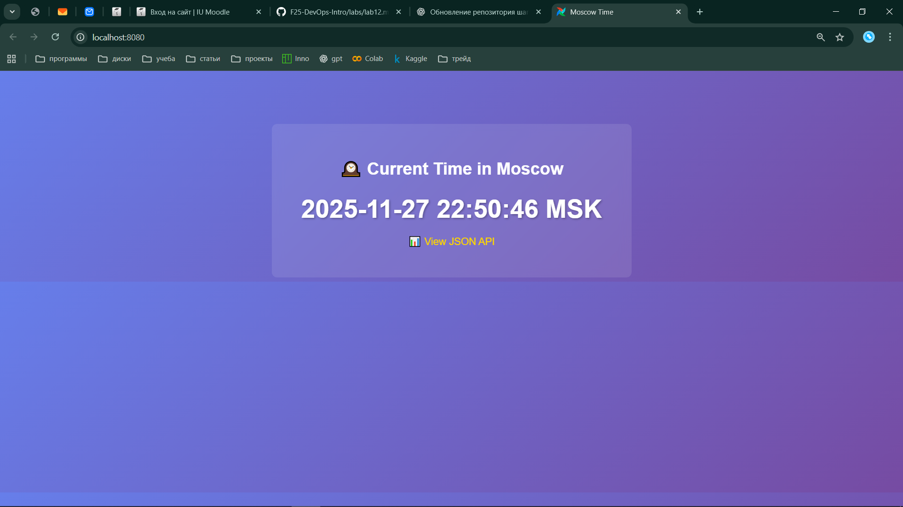
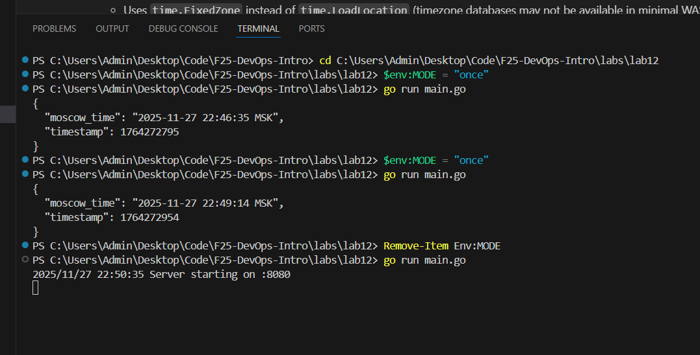
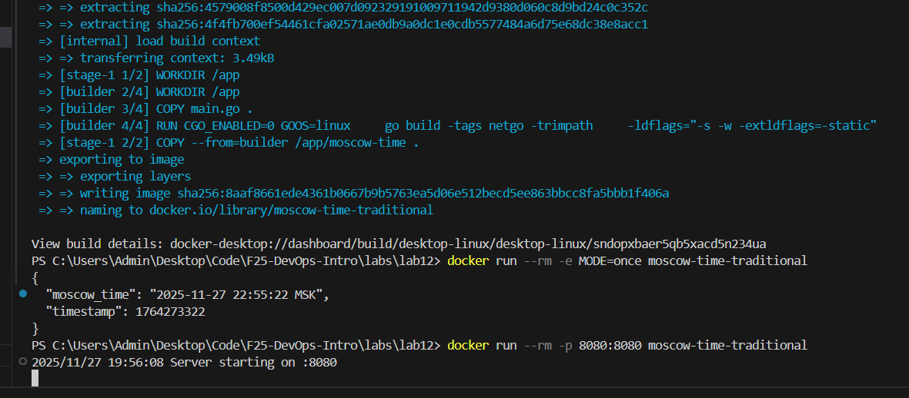
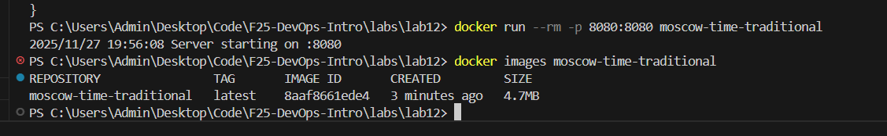
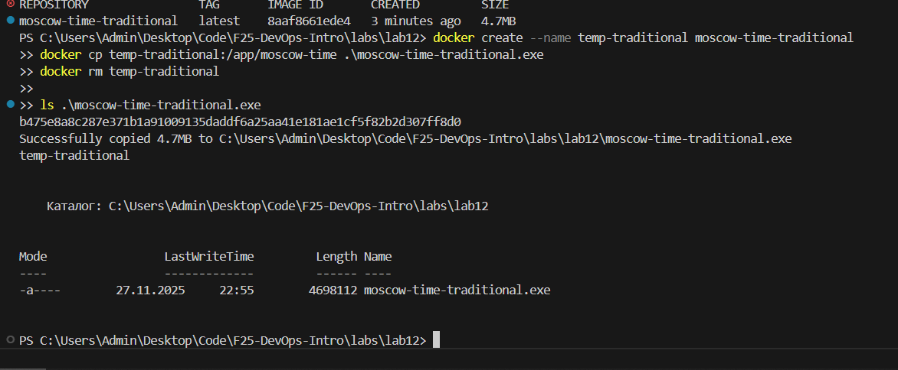
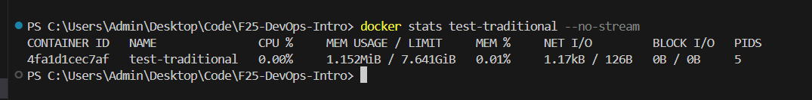

# Lab 12 — WebAssembly Containers vs Traditional Containers  
Submission for: Имя Фамилия  
Repository directory: `labs/lab12/`

---

## Task 1 — Moscow Time Application

### 1.1. Working directory

All commands were executed from the lab folder:

```text
C:\Users\Admin\Desktop\Code\F25-DevOps-Intro\labs\lab12
```

### 1.2. CLI mode (`MODE=once`)

I ran the application in CLI mode from PowerShell by setting the `MODE` environment variable:

```powershell
$env:MODE = "once"
go run main.go
```

Example output:

```json
{
  "moscow_time": "2025-11-27 22:46:35 MSK",
  "timestamp": 1764272795
}
```

(Additional runs produced similar JSON with updated time.)

### 1.3. Server mode (HTTP)

To test server mode I removed `MODE` and started the HTTP server:

```powershell
Remove-Item Env:MODE
go run main.go
```

The server started on port 8080:

```text
2025/11/27 22:50:35 Server starting on :8080
```

In the browser I opened `http://localhost:8080` and saw the Moscow time page:

### 1.4. How the single `main.go` works in three contexts

The provided `main.go` is written so that the same source file can run in three different execution contexts:

1. **CLI mode (`MODE=once`)**  
   - If environment variable `MODE` is set to `once`, the program calculates the current Moscow time, prints one JSON object to STDOUT, and exits.  
   - This mode is used for reproducible startup-time benchmarks in both Docker and WASM.

2. **Traditional server mode (`net/http`)**  
   - If `MODE` is not `once` and the program is not running under WAGI, it starts a normal Go HTTP server on `:8080` using the standard `net/http` package.  
   - The root handler renders an HTML page with the current time and also exposes a JSON API endpoint.

3. **WAGI/Spin mode**  
   - The helper function `isWagi()` checks for CGI-style environment variables such as `REQUEST_METHOD`.  
   - When they are present (Spin WAGI executor), `runWagiOnce()` is used: it writes HTTP headers and a JSON body to STDOUT in CGI/WAGI format.  
   - Spin/edge platform handles the actual HTTP listener and process lifecycle; the Go code only needs to read env vars and write the response.

The program also uses `time.FixedZone` instead of `time.LoadLocation`, which avoids relying on OS timezone databases that may be missing in minimal container or WASM environments.

---

## Task 2 — Traditional Docker Container

### 2.1. Dockerfile review

I used the provided `labs/lab12/Dockerfile`. It:

- Builds the Go binary in a `golang:1.21-alpine` stage.
- Uses `CGO_ENABLED=0` and flags `-tags netgo -trimpath -ldflags="-s -w -extldflags=-static"` to get a small, statically linked binary.
- Copies the binary into a `FROM scratch` runtime image, resulting in a minimal container.

### 2.2. Build and run

Build command:

```powershell
docker build -t moscow-time-traditional -f Dockerfile .
```

CLI mode inside the container:

```powershell
docker run --rm -e MODE=once moscow-time-traditional
```

Example JSON output from inside Docker:

```json
{
  "moscow_time": "2025-11-27 22:55:22 MSK",
  "timestamp": 1764273322
}
```

Server mode in Docker:

```powershell
docker run --rm --name test-traditional -p 8080:8080 moscow-time-traditional
```

Then I opened `http://localhost:8080` and verified that the same Moscow Time page is served from inside the container.

### 2.3. Binary size

I copied the compiled binary out of the container and checked its size:

```powershell
docker create --name temp-traditional moscow-time-traditional
docker cp temp-traditional:/app/moscow-time .\moscow-time-traditional.exe
docker rm temp-traditional

ls .\moscow-time-traditional.exe
```

Result:

- Length: `4 698 112` bytes ≈ **4.48 MiB** (reported also as “4.7MB” by Docker copy message).

### 2.4. Image size

I checked the image size with `docker images`:

```powershell
docker images moscow-time-traditional
```

Result:

- `moscow-time-traditional:latest` — **4.7MB**

(Optionally, `docker image inspect` can be used for exact bytes.)

### 2.5. Memory usage (server mode)

With the container running as `test-traditional` in server mode, I ran:

```powershell
docker stats test-traditional --no-stream
```

Result:

- `MEM USAGE / LIMIT`: **1.152MiB / 7.641GiB**  
- `MEM %`: about **0.01%**

I will use **1.152 MiB** as the reference memory usage value for the traditional container in the comparison table.

---

## Task 3 — WASM Container (ctr-based)

> Note: this part is to be done on a Linux host with containerd and the wasmtime shim installed. Values below are placeholders until measurements are collected.

### 3.1. TinyGo version

Command:

```bash
docker run --rm tinygo/tinygo:0.39.0 tinygo version
```

Result (to fill in):

```text
tinygo version 0.39.0 linux/amd64  # example
```

### 3.2. Build WASM binary

From `labs/lab12`:

```bash
docker run --rm   -v ${PWD}:/src   -w /src   tinygo/tinygo:0.39.0   tinygo build -o main.wasm -target=wasi main.go
```

Check size:

```bash
ls -lh main.wasm
file main.wasm
```

Result (to fill in):

- Binary size: `TODO` (e.g. `0.9M`)

### 3.3. WASM image build and import

Build OCI archive:

```bash
docker buildx build   --platform=wasi/wasm   -t moscow-time-wasm:latest   -f Dockerfile.wasm   --output=type=oci,dest=moscow-time-wasm.oci,annotation=index:org.opencontainers.image.ref.name=moscow-time-wasm:latest   .
```

Import into containerd:

```bash
sudo ctr images import   --platform=wasi/wasm   --index-name docker.io/library/moscow-time-wasm:latest   moscow-time-wasm.oci
```

Check image size:

```bash
sudo ctr images ls | awk 'NR>1 && $1 ~ /moscow-time-wasm/ {print "IMAGE:", $1, "SIZE:", $4}'
```

Result (to fill in):

- WASM image size: `TODO` (e.g. `1.2MiB`)

### 3.4. CLI mode via `ctr`

Benchmark command (run multiple times):

```bash
for i in {1..5}; do
  NAME="wasi-$(date +%s%N | tail -c 6)-$i"
  /usr/bin/time -f "%e" sudo ctr run --rm     --runtime io.containerd.wasmtime.v1     --platform wasi/wasm     --env MODE=once     docker.io/library/moscow-time-wasm:latest "$NAME" 2>&1 | tail -n 1
done | awk '{sum+=$1; n++} END{printf("Average: %.4f seconds\n", sum/n)}'
```


### 3.5. Server mode limitation and memory

- Running without `MODE=once` under `ctr` does **not** work as an HTTP server because WASI Preview1 does not support TCP sockets. `net/http` cannot bind to `:8080` inside plain WASI.
- HTTP server mode for the same `main.wasm` can be demonstrated via Spin in WAGI mode (Bonus task), where Spin provides the HTTP abstraction.

Memory usage for WASM containers is not available via `ctr` in the same way as Docker’s `docker stats`, because the wasmtime runtime manages WASM memory internally and cgroup metrics are not exposed.  
In the table I mark this as **N/A – not available via ctr**.

---

## Task 4 — Performance Comparison & Analysis

### 4.1. Comparison table

When Task 3 measurements are ready, fill the values below. Traditional metrics are already populated from Task 2.

| Metric                     | Traditional Container            | WASM Container         | Improvement           | Notes |
|----------------------------|----------------------------------|------------------------|-----------------------|-------|
| **Binary Size**           | ~4.48 MiB (~4.7 MB)              | TODO MiB              | TODO % smaller        | `go` vs TinyGo WASM |
| **Image Size**            | 4.7 MB                           | TODO MB               | TODO % smaller        | `docker images` / `ctr images ls` |
| **Startup Time (CLI)**    | TODO s (avg over 5 runs)         | TODO s (avg over 5)   | TODO× faster          | Use `MODE=once` for both |
| **Memory Usage (server)** | 1.152 MiB (Docker `stats`)       | N/A                    | —                     | ctr does not expose WASM memory |
| **Base Image**            | `scratch`                        | `scratch`             | Same                  | Both minimal |
| **Source Code**           | `main.go`                        | `main.go`             | Identical             | Same file for both |
| **Server Mode**           | Works (`net/http` in Docker)   | via `ctr` ; via Spin | —                   | WASI Preview1 lacks sockets; Spin provides HTTP via WAGI |

### 4.2. Analysis questions

1. **Binary size comparison**

   - The traditional Go binary includes the full Go runtime and more of the standard library, even with optimizations.  
   - TinyGo compiles to WASM and aggressively strips unused parts of the runtime and standard library, performs dead-code elimination, and generates a much more compact representation.  
   - As a result, the `main.wasm` binary is expected to be significantly smaller (often 80–90% smaller) than the native Linux binary.

2. **Startup performance**

   - A traditional container has to start a full Linux process inside a container, set up namespaces and cgroups, and then load a relatively large binary into memory before executing `main`.  
   - A WASM container with wasmtime only needs to instantiate a lightweight WASM module inside the existing runtime; the module is smaller and has less initialization work.  
   - Therefore, the WASM version usually starts faster in CLI mode, especially when measured over repeated cold starts.

3. **When to choose WASM vs traditional containers**

   - **Choose WASM** when you need:
     - Very fast cold starts (functions, serverless-style workloads).  
     - Small image sizes and efficient distribution.  
     - Strong sandboxing and portability across different hosts.
   - **Choose traditional containers** when you need:
     - Full networking (raw TCP/UDP sockets) and rich OS capabilities.  
     - Access to the complete Go standard library and ecosystem without WASI limitations.  
     - Complex services that rely on background processes, multi-threading, or OS-level features that are not yet available in WASI.

### 4.3. Screenshots





