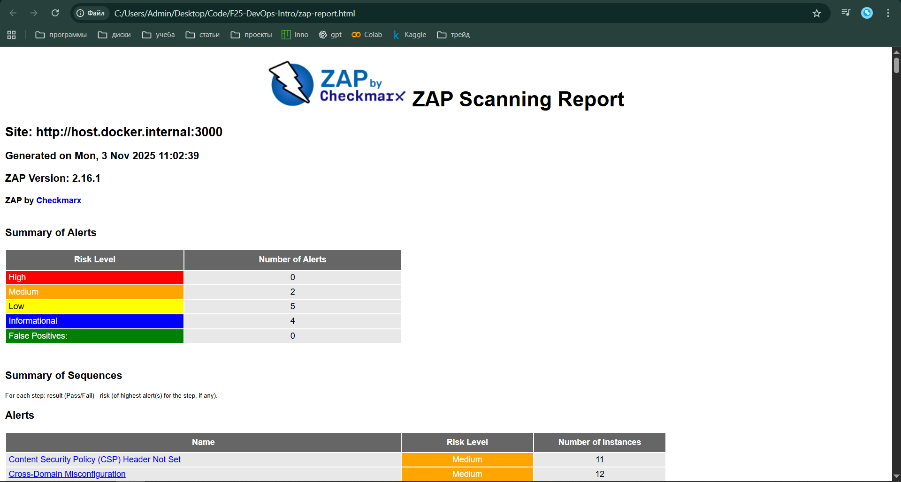
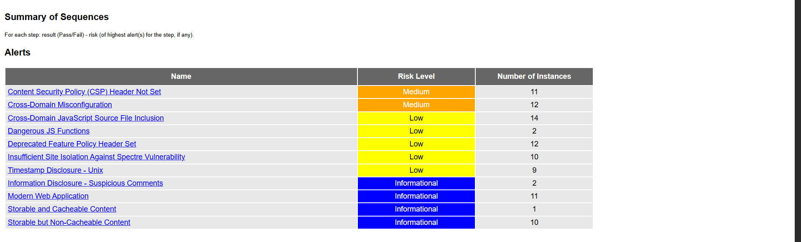

# Lab 9 — DevSecOps Tools

## Task 1 — Web Application Scanning (OWASP ZAP) 
**Target:** `http://host.docker.internal:3000`   

### Summary
| Risk Level | Alerts |
| ----------- | -------: |
| High        | 0 |
| Medium      | 2 |
| Low         | 5 |
| Informational | 4 |

**Medium vulnerabilities found:** 2  

1. **Content Security Policy (CSP) Header Not Set**  
   - **Description:** The absence of a CSP header allows injection of malicious scripts, fonts, or frames (e.g., XSS attacks).  
   - **URLs affected:** `/`, `/ftp/*`  
   - **Recommendation:** Add the `Content-Security-Policy` header to the web server configuration.  
   - **CWE:** [693](https://cwe.mitre.org/data/definitions/693.html)

2. **Cross-Domain Misconfiguration (CORS)**  
   - **Description:** The server allows all origins via `Access-Control-Allow-Origin: *`, enabling potential data leaks through cross-origin requests.  
   - **URLs affected:** `/`, `/assets/public/favicon_js.ico`, `/ftp/acquisitions.md`  
   - **Recommendation:** Restrict allowed origins by specifying trusted domains.  
   - **CWE:** [942](https://cwe.mitre.org/data/definitions/942.html)

### Security Headers
| Header | Status |
| ------- | ------- |
| Content-Security-Policy | Missing |
| X-Frame-Options | Missing |
| X-Content-Type-Options | Present |
| Strict-Transport-Security | Missing |

**Why it matters:** Missing CSP and HSTS headers increase the risk of XSS and MITM attacks. The lack of X-Frame-Options enables clickjacking.

### Screenshot

### Analysis
The main security issues are weak security configurations — missing headers and overly permissive CORS settings. These fall under **OWASP A05:2021 — Security Misconfiguration**.

---

## Task 2 — Container Vulnerability Scanning (Trivy)

**Image:** `bkimminich/juice-shop (debian 12.11)`  
**Scanner:** Trivy (`aquasec/trivy:latest`)

### Summary
| Severity | Count |
| --------- | -----: |
| CRITICAL  | 8 |
| HIGH      | 22 (Node.js) + 1 (OS) = **23** |
| **Total** | **31** |

### Notable Vulnerabilities

| Package | CVE ID | Severity | Description / Risk |
| -------- | ------- | -------- | ------------------ |
| `libc6` | [CVE-2025-4802](https://avd.aquasec.com/nvd/cve-2025-4802) | HIGH | glibc: incorrect `LD_LIBRARY_PATH` handling in setuid binaries |
| `crypto-js` | [CVE-2023-46233](https://avd.aquasec.com/nvd/cve-2023-46233) | CRITICAL | PBKDF2 implemented 1.3M times weaker than standard |
| `jsonwebtoken` | [CVE-2015-9235](https://avd.aquasec.com/nvd/cve-2015-9235) | CRITICAL | JWT signature verification bypass |
| `lodash` | [CVE-2019-10744](https://avd.aquasec.com/nvd/cve-2019-10744) | CRITICAL | Prototype pollution vulnerability |
| `marsdb` | [GHSA-5mrr-rgp6-x4gr](https://github.com/advisories/GHSA-5mrr-rgp6-x4gr) | CRITICAL | Command injection risk |
| `vm2` | [CVE-2023-32314](https://avd.aquasec.com/nvd/cve-2023-32314) | CRITICAL | Sandbox escape vulnerability |
| `ws` | [CVE-2024-37890](https://avd.aquasec.com/nvd/cve-2024-37890) | HIGH | DoS via excessive HTTP header handling |
| `/juice-shop/lib/insecurity.ts` | Private RSA key | HIGH | Exposed RSA private key in source code |

### Most Common Vulnerability Types
- Prototype pollution  
- JWT verification bypass  
- Denial-of-Service (DoS)  
- Sensitive data exposure (private key leakage)

### Analysis
Trivy revealed both dependency-level and code-level issues. Node.js libraries contain critical CVEs, and hard-coded private keys were detected. Regular image scanning helps prevent shipping insecure builds and ensures dependency hygiene.

### Reflection
Container image scanning should be integrated into CI/CD pipelines.  
Recommended approach:
- Run `trivy image` on every build.  
- Fail the build if CRITICAL vulnerabilities are found.  
- Store scan reports as build artifacts for security review.  
